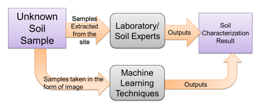

# SoilSense
SoilSense is a web application that uses image processing techniques to classify the type of soil from an image and identify its properties that will help planters in making an accurate decision with regards to planting.

## Why classify the soil?
Soil analysis plays a pivotal role in urban gardening. One of the primary challenges faced by gardeners, especially newcomers to planting, is their limited understanding of soil classification and the properties associated with different soil types. Consequently, they often plant various crops without adequately comprehending the specific requirements of the soil they're using. They rely solely on regular watering and sunlight exposure, hoping their plants will thrive. Unfortunately, this approach often results in undernourished or deceased plants, leading to wasted time, effort, and money.

### The Problems SoilSense aims to solve
- There is no accessible application/tool for soil analysis for better plant decision making.
- It is difficult to identify whether a certain plant will grow on the current available soil.
- Soil classification is expensive and time consuming because it has to undergo laboratory.
- Develop methodology that works well on identifying the type of soil based on its physical characteristics.

